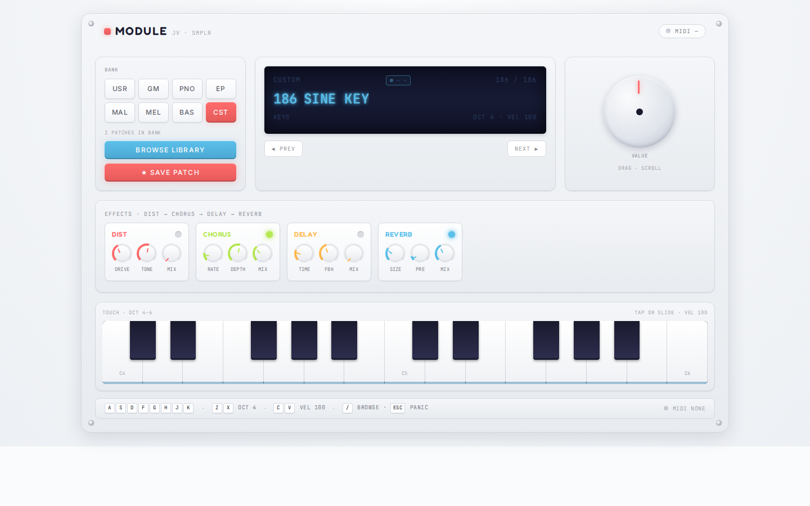

# MODULE

A browser-based **Roland JV‑style sound module**. Plug in a MIDI keyboard (or use the
on-screen / Ableton-style computer keyboard), pull up a patch from the full
[smplr](https://github.com/danigb/smplr) instrument family, and jam through a
fixed Distortion → Chorus → Delay → Reverb effects chain.



---

## What it does

- **300+ patches** across 8 banks (GM Soundfont, Splendid Grand, Electric Pianos,
  Mallets, Mellotrons, Double Bass, custom samples, your saved presets)
- **Three input modes** simultaneously: MIDI controller (Web MIDI API), Ableton-style
  computer keyboard (`A–L` rows), and a multitouch on-screen keyboard
- **Effects chain** wired in raw Web Audio: WaveShaper distortion, LFO chorus,
  feedback delay, ConvolverNode reverb. No Tone.js dependency. Each effect is a
  stompbox — status LED, pots two to a row, and a footswitch that stomps it in
  and out
- **Local-first storage cascade**: vendored files → alt-format fallback → persistent
  Cache API → live CDN, with a coloured **LOCAL / CACHE / CDN / MIX** badge in the
  LCD so you always know where the audio came from
- **In-session LRU cache** of 3 loaded smplr instruments — switching back to a
  previously-loaded patch is instant
- **User patches**: tap `★ SAVE PATCH` to snapshot the current base patch + FX state
  to localStorage. Saved patches appear in the `USR` bank in the picker
- **Offline by default**: any patch you load — or preview — is cached as it
  loads, so it stays playable with no connection. The picker's download button
  pre-fills the cache for a patch you have not played yet. A patch is only
  marked cached when *every* sample resolved, so the offline greyout is honest
- **Library previews**: tap ▶ on a card to audition a patch (a C–G run and a C
  major chord) without leaving the one you are playing. The audition fetches the
  same samples a real load would, so it doubles as a download
- **Keyboard mode**: `⌨ KEYBOARD MODE` hands the screen to the keys — a one-line
  patch readout on top, the pedalboard behind a show/hide toggle

---

## Quick start

```bash
git clone https://github.com/pepperhorn/module.git
cd module
npm install
npm run dev
```

Then open the Network URL Vite prints (e.g. `http://192.168.1.5:5174`) on your
phone or laptop. **First load is over the network** — every patch fetches its
samples lazily from the upstream CDNs the first time you pick it. Subsequent
loads in the same session are instant (LRU cache); subsequent reloads are fast
(persistent browser Cache API). To eliminate the CDN dependency entirely, see
[Vendoring samples](#vendoring-samples) below.

---

## Sample libraries

Every patch in the picker is loaded via [smplr](https://github.com/danigb/smplr)
from one of these upstream sample sets. The local-first storage cascade rewrites
each upstream URL to a `/smplr-samples/<host>/<path>` mirror under `public/`,
then falls back to the upstream if the local file isn't present.

| Bank | Patch family | smplr class | Upstream source | License |
|---|---|---|---|---|
| **PNO** | Splendid Grand Piano (1) | `SplendidGrandPiano` | [smpldsnds/sfzinstruments-splendid-grand-piano](https://github.com/smpldsnds/sfzinstruments-splendid-grand-piano) | CC0 |
| **EP** | CP80, Pianet T, Wurlitzer EP200 (3) | `ElectricPiano` | [smpldsnds/sfzinstruments-greg-sullivan-e-pianos](https://github.com/smpldsnds/sfzinstruments-greg-sullivan-e-pianos) | CC-BY |
| **EP** | TX81Z FM Piano (1) | `ElectricPiano` | [smpldsnds/sgossner-vcsl](https://github.com/smpldsnds/sgossner-vcsl) (Versilian Community Sample Library) | CC0 |
| **GM** | 128 General MIDI Soundfonts | `Soundfont` (kit: MusyngKite) | [gleitz/midi-js-soundfonts](https://github.com/gleitz/midi-js-soundfonts) | MIT |
| **MAL** | Balafon, Tubular Bells, Vibraphone, Xylophone (14 variants) | `Mallet` (Versilian) | [smpldsnds/sgossner-vcsl](https://github.com/smpldsnds/sgossner-vcsl) | CC0 |
| **MEL** | Mellotron M300 / M400 / MKII / Tron family (34 variants) | `Mellotron` | [smpldsnds/archiveorg-mellotron](https://github.com/smpldsnds/archiveorg-mellotron) (Internet Archive) | Public domain |
| **BAS** | Smolken Double Bass — Arco / Pizzicato / Switched (3) | `Smolken` | [smpldsnds/sfzinstruments-dsmolken-double-bass](https://github.com/smpldsnds/sfzinstruments-dsmolken-double-bass) | CC-BY |
| **CST** | Sine Key, Poly Bass (2 demo patches) | `CustomSampler` (raw Web Audio) | Bundled in `public/patches/` (generated locally) | this repo |
| **USR** | User-saved presets | (any of the above) | `localStorage` snapshot of base patch + FX state | n/a |

The catalog (`src/patches/builtin.ts`) generates all 187 built-in patches at
runtime by calling smplr's `getSoundfontNames()`, `getElectricPianoNames()`,
`getMalletNames()`, `getMellotronNames()`, and `getSmolkenNames()`. Custom
patches under `public/patches/<id>/patch.json` are merged in via Vite's
`import.meta.glob` at build time.

---

## Vendoring samples

The smplr CDN hosts (`smpldsnds.github.io`, `gleitz.github.io`) are mostly
reliable but **slow on mobile networks** and have a handful of genuinely-missing
files in some sample sets. The vendoring script downloads any sample set you
specify into `public/smplr-samples/<host>/<path>` so the dev server (and any
production deploy) can serve them locally with zero network round-trip.

### Vendoring presets locally

```bash
# All four electric pianos (340 files, ~12 MB)
npm run vendor-samples ep:all

# Just CP80
npm run vendor-samples ep:cp80

# Splendid Grand Piano (large — 720 files, ~140 MB)
npm run vendor-samples piano:splendid

# Curated GM groups
npm run vendor-samples gm:keys gm:bass gm:strings gm:brass gm:guitar

# A specific GM instrument
npm run vendor-samples gm:acoustic_grand_piano

# Everything in GM (~250 MB)
npm run vendor-samples gm:all

# Smolken double bass
npm run vendor-samples smolken:Arco
```

The script downloads BOTH `.ogg` and `.m4a` for every sample so the storage
can fall back when one format is missing on the upstream (this fixes 3 silent
notes in CP80, for example).

After vendoring, the LCD source badge will show **LOCAL** (lime) when the
patch is fully served from your local mirror, and the in-engine log will show
`local ✓ ...` for every sample.

### Including vendored samples in a deploy

`public/smplr-samples/` is **gitignored** by default to keep the repo small.
Two ways to ship the samples with your build:

**Option A — vendor at build time on your CI/host:**

```yaml
# Example: GitHub Actions / Netlify / Vercel build step
- run: npm install
- run: npm run vendor-samples ep:all gm:keys piano:splendid
- run: npm run build
```

The vendored files end up under `dist/smplr-samples/` and are served by your
static host alongside the JS bundle. First-time visitors hit your CDN/origin
for the audio, not `smpldsnds.github.io`.

**Option B — commit the vendored samples to a separate branch / Git LFS:**

If you want reproducible deploys without re-vendoring on every CI run, remove
`public/smplr-samples/` from `.gitignore` and commit them. For sets larger than
~50 MB, use [Git LFS](https://git-lfs.com/) to keep the main repo small:

```bash
git lfs install
git lfs track "public/smplr-samples/**/*.ogg"
git lfs track "public/smplr-samples/**/*.m4a"
git lfs track "public/smplr-samples/**/*.js"
git add .gitattributes public/smplr-samples
git commit -m "vendor: add CP80 + GM keys samples (LFS)"
```

**Option C — fully offline / self-hosted samples bundle:**

For an air-gapped deploy, vendor `gm:all` + `ep:all` + `piano:splendid` and
ship the entire `public/smplr-samples/` tree. Total size is roughly 400 MB.
The local-first storage will never reach the upstream CDN if every URL it
asks for resolves locally.

---

## Storage cascade

Every smplr sample fetch goes through `src/audio/loggedStorage.ts`'s 4-tier
cascade (in order):

1. **Local file** — `/smplr-samples/<host>/<original-path>` from your `public/`
   folder. Vite serves these with the right content-type. Hits here are instant.
2. **Alt format** — same path with `.ogg ⇄ .m4a` swapped. Some upstream sample
   sets have one format but not the other; vendoring grabs both, and this tier
   bridges the gap automatically.
3. **Cache API** — persistent `module-cdn-v1` browser cache populated on every
   CDN miss. Survives reloads and offline sessions.
4. **Live CDN** — actual `fetch()` to the upstream URL, with the response
   simultaneously written to the Cache API for next time.

The LCD source badge tells you which tiers were used for the *currently active*
patch:

- **LOCAL** (lime) — 100% from tier 1 / 2
- **CACHE** (sky) — 100% from tier 3 (offline-ready from a previous session)
- **CDN** (amber) — 100% from tier 4 (slow first load over the network)
- **MIX** (lavender) — split across tiers (e.g. partial vendoring)

Hover (or long-press on mobile) the badge to see the precise per-tier counts.

---

## Tech

- **React 19** + **TypeScript** + **Vite 8**
- **Tailwind CSS 4** with `@theme` tokens (`src/index.css`)
- **Zustand** for state (`src/state/useStore.ts`), persisted per-key to
  `localStorage` under `module:state:v1`, `module:favourites:v1`,
  `module:downloaded:v1`, `module:user-patches:v1`
- **smplr** ^0.20 for instrument loading and voice scheduling
- **Raw Web Audio** for the FX chain (no Tone.js — Tone's `Listener` wrapper
  crashes on iOS Safari and mobile Firefox in this app's call path)
- **Web MIDI API** for hardware controllers
- Mobile-first: serial `decodeAudioData` queue + 4-concurrent fetch throttle
  to avoid the parallel-decode race that silently kills sample loads on mobile
  Firefox

---

## Inspirations

- Visual language adapted from [pepperhorn/drumlet](https://github.com/pepperhorn/drumlet)
  (palette, fonts, library picker pattern)
- Effects chain pattern adapted from [pepperhorn/vocoder](https://github.com/pepperhorn/vocoder)
- Roland JV-1080 / JV-2080 hardware silhouette: 1U-rack proportions, central
  LCD, banked button grid

---

## License

The application code is yours to use. Each upstream sample library is licensed
separately — see the table above. The bundled custom patches under
`public/patches/` (sine-key, poly-bass) are generated locally and free to use.
